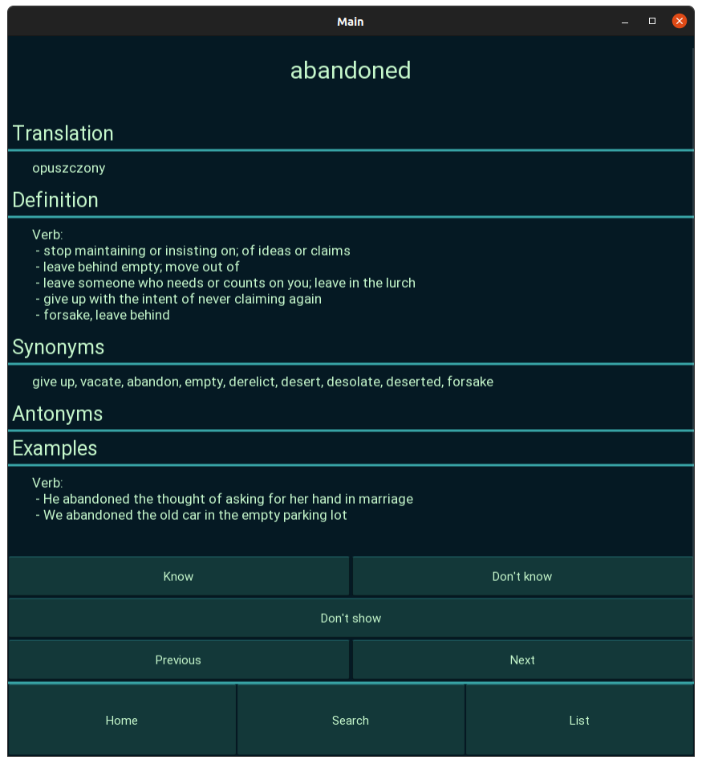
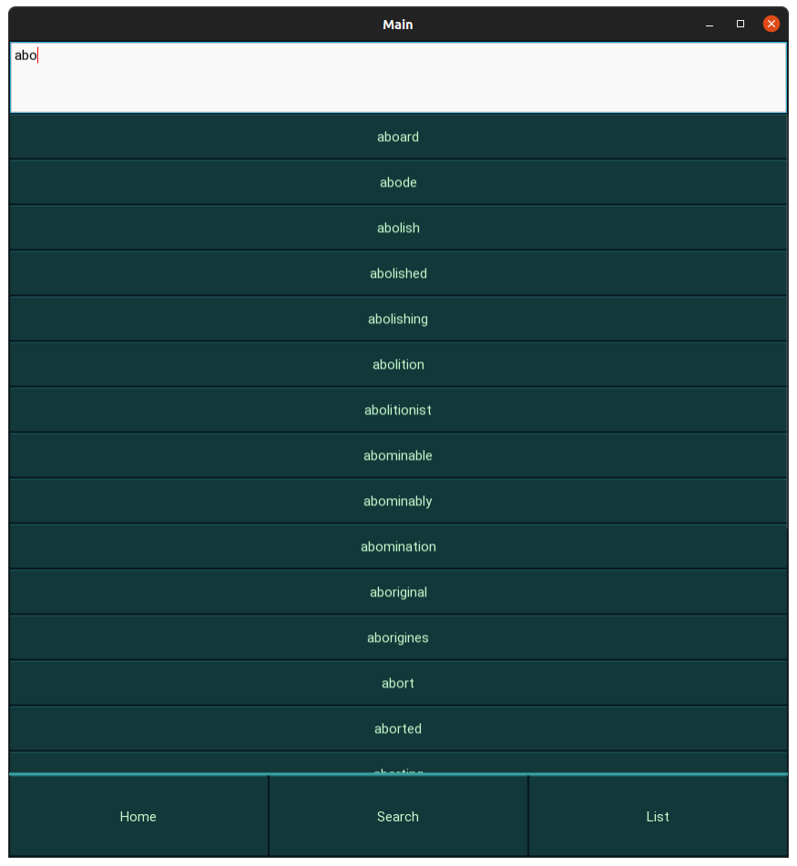
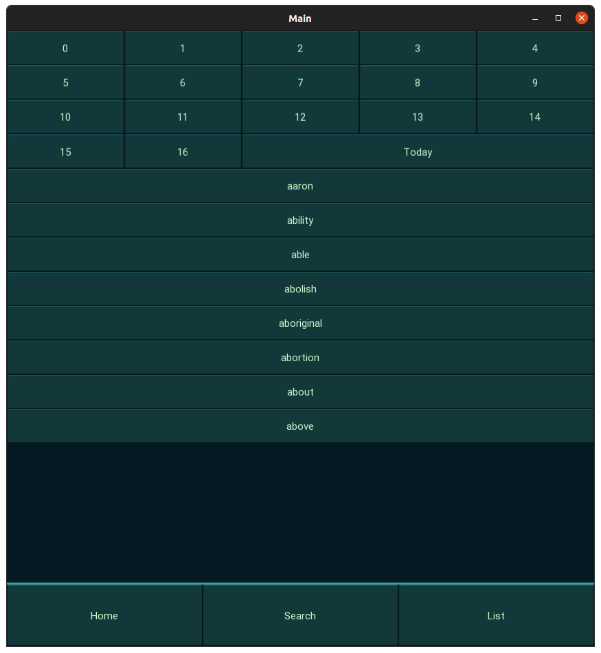
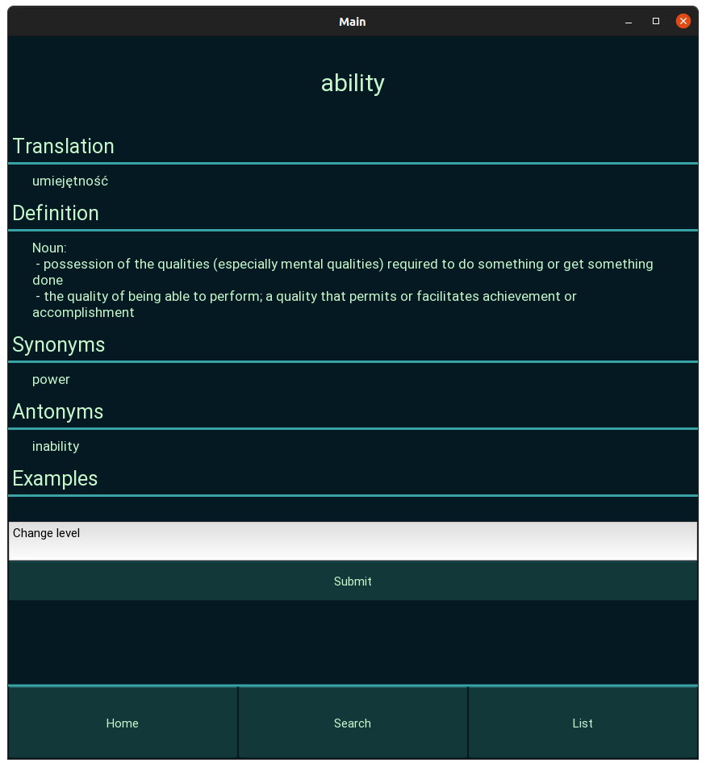

# Minimalistic English Vocabulary App

This app is meant to be a free alternative for other english learning apps, especially those which bombard you with adds every few seconds. It works by showing you a batch of words every day and for each word you will see its translation to your native language alongisde with its definition, synonyms and antonyms (definition, synonyms and antonyms are only shown in english lanugage). For each word you have to decide whether you remember this word or need to revise it, and this decision will impact when you will see this word next time. *Minimalistic English Vocabulary App* is based on a simple premise: the better you know given word, the rarier it will be shown to you in the daily batch. This is meant to boost the learning process and maximize the memorization of the vocabulary.

## Installation (Desktop mode)

If you want to use all the features of this application (main application + database creation scripts) run the following command inside minimalistic_english_vocabulary_app folder:
```
pip install -r full_requirements.txt
```

If you just want to use main application run the following command inside minimalistic_english_vocabulary_app folder:
```
pip install -r minimum_requirements.txt
```

## Usage

To use the application run main.py.

Home screen has the following buttons:
- "Know" - show the word with increased time delay
- "Don't know" - show the word on the following day
- "Don't show" - never show this word again
- "Previous" - move to previous word
- "Next" - move to next word

Search screen allows you to look up arbitrary word from dictionary. If you click on the word, you can edit its level<sup>1</sup>

List screen shows all the words from dictionary grouped by its level. Moreover, you can view the words that you have learned on that day. Each word is clickable and allows you to edit its level.

## Images

<p float="left">
  
   
  
   
</p>

-------------------------------------------
<sup>1</sup> Level of the words determines when it is to be shown in the app. It is a value in range [0 ,16]. 0 means that you haven't seen this word yet. 16 means that you know this word and it will never be shown again. "Know" button increments level value, while "Don't know" button sets it to 1. To see levels and corresponding time delays see constants.py
